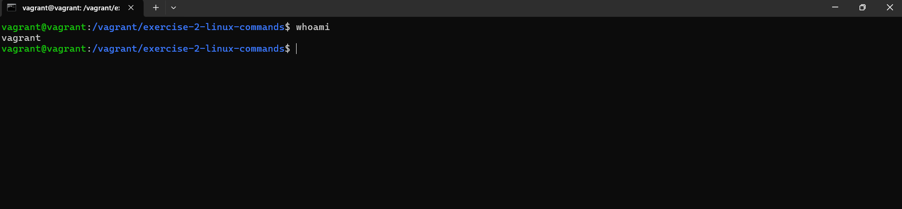
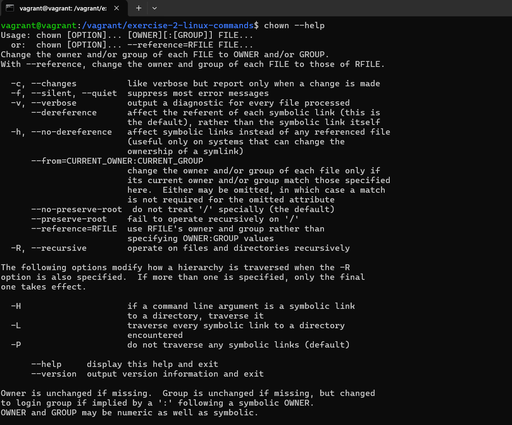
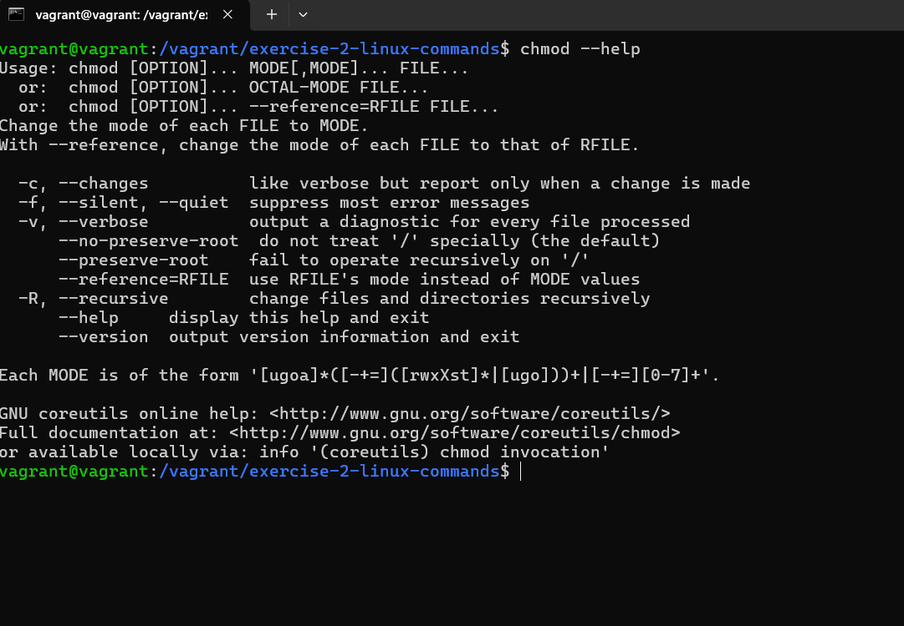
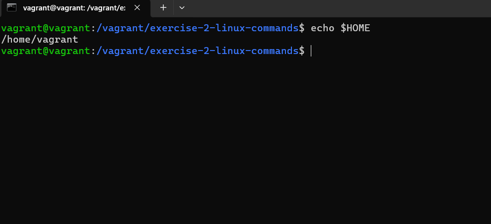
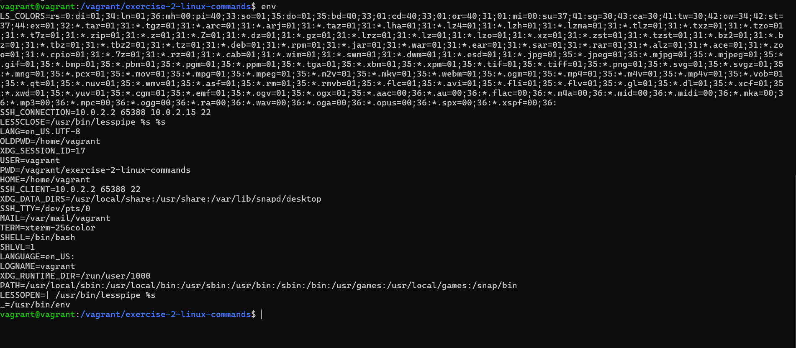
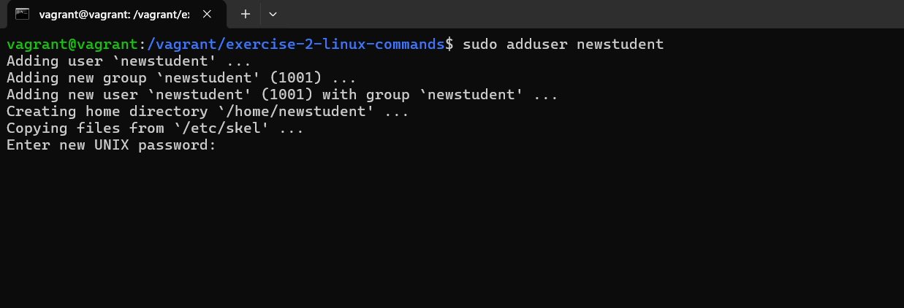
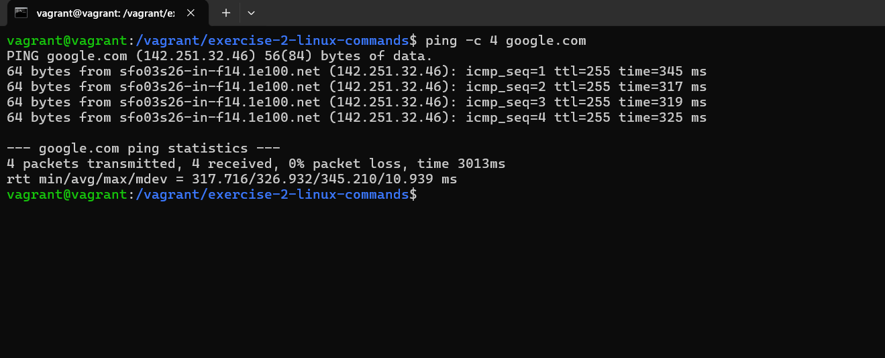
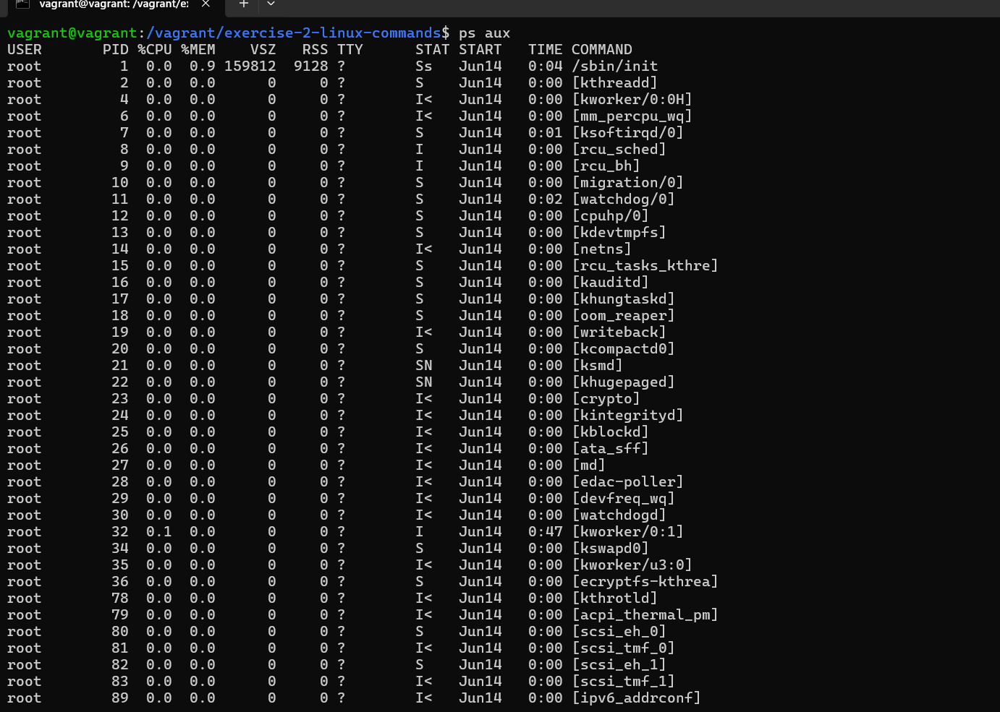
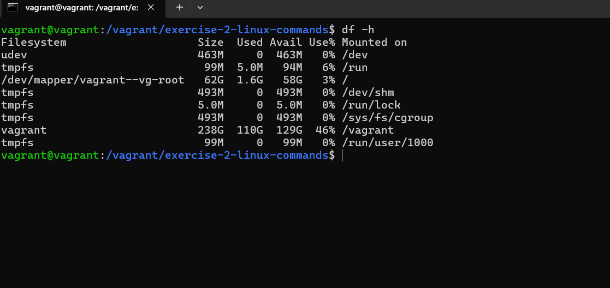
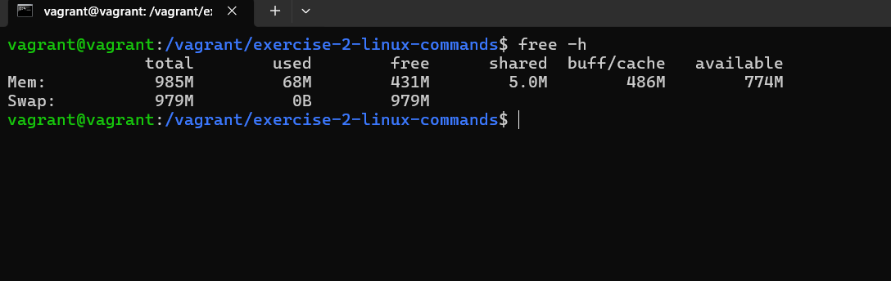

# Exercise 2: 10 More Linux Commands

Explaination of 10 more Linux commands

## 1. `whoami`

Shows who is the current user.

**example:**

```bash
whoami
```


## 2. `chown`

Change file or directory ownership.

**example:**

```bash
chown user:group filename
```


## 3. 'chmod'

Modify file or directory permissions.

**example:**

```bash
chmod script.sh
```


## 4. 'echo'

Print text or environment variables.

**example:**

```bash
echo $HOME
```


## 5. 'env'

Display all environment variables.

**example:**

```bash
env
```


## 6. 'suddo adduser'

Add a new user (requires superuser privileges).

**example:**

```bash
sudo adduser newuser
```


## 7. 'ping'

Test connectivity to a host.

**example:**

```bash
ping -c 4 google.com
```


## 8. 'ps'

View active processes.

**example:**

```bash
ps aux
```


## 9. 'df'

Show disk space usage.

**example:**

```bash
df -h
```


## 10. 'free'

Display memory usage.

**example:**

```bash
free -h
```

